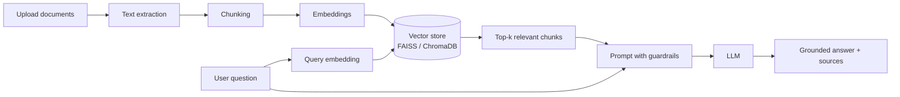

# Sensitive-Data-Detection-Compliance-Assistant

A Retrieval-Augmented Generation (RAG) application that answers questions about compliance documents and flags sensitive data. Every answer is grounded in text retrieved from the uploaded files, which reduces hallucinations and lets users check the source.

**Live demo:** [add link if deployed] &nbsp;|&nbsp; **Built with:** Python, LangChain, FAISS/ChromaDB, Hugging Face, OpenAI API, Streamlit

---

## Why this project

Compliance teams spend hours searching long policy and regulatory documents for specific clauses, and a generic LLM may invent answers when it has no source. This project:

- Answers questions **only from the uploaded documents**
- Shows the **source passages** behind each answer
- Applies **guardrails** so the model declines when the documents don't contain the answer
- Detects **sensitive data** in the documents *(describe what is detected, e.g. emails, phone numbers, IDs, and how)*

## Features

- Upload documents and ask questions in natural language
- End-to-end RAG pipeline: ingestion, chunking, embeddings, vector search, grounded generation
- Two vector store options: **FAISS** and **ChromaDB**
- Semantic retrieval with prompt engineering aimed at grounded responses
- Guardrails: answers are restricted to retrieved context, with a fallback when no relevant context is found
- Interactive **Streamlit** interface

## Architecture



**How it works**

1. **Ingestion:** documents are uploaded and their text is extracted.
2. **Chunking:** text is split into overlapping chunks (chunk size: `[value]`, overlap: `[value]`).
3. **Embedding:** each chunk is converted into a vector using `[embedding model name]`.
4. **Indexing:** vectors are stored in FAISS or ChromaDB.
5. **Retrieval:** the question is embedded and the top-`k` (`[value]`) most similar chunks are retrieved.
6. **Generation:** the retrieved chunks and the question go into a prompt that instructs the LLM to answer only from the context. If the context doesn't support an answer, the app says so.

## Tech stack

| Area | Tools |
|---|---|
| Language | Python |
| Orchestration | LangChain |
| Vector search | FAISS, ChromaDB |
| Models | Hugging Face embeddings, OpenAI API |
| Interface | Streamlit |

## Project structure

```
.
├── app.py              # Streamlit app entry point
├── modules/            # Pipeline components (ingestion, embeddings, retrieval, etc.)
├── uploads/            # Local folder for uploaded files (not tracked by Git)
├── requirements.txt    # Python dependencies
└── README.md
```

<!-- Update the tree above to list the actual files inside modules/ -->

## Getting started

### Prerequisites

- Python 3.10 or higher
- An OpenAI API key

### Installation

```bash
git clone https://github.com/aasthasethi28/Sensitive-Data-Detection-Compliance-Assistant.git
cd Sensitive-Data-Detection-Compliance-Assistant

python -m venv venv
source venv/bin/activate        # Windows: venv\Scripts\activate

pip install -r requirements.txt
```

### Configuration

Create a `.env` file in the project root:

```
OPENAI_API_KEY=your_key_here
```

Never commit this file. Make sure `.env` is listed in `.gitignore`.

### Run the app

```bash
streamlit run app.py
```

Then open the URL shown in the terminal (usually `http://localhost:8501`).

## Usage

1. Upload one or more documents (supported formats: `[PDF, TXT, ...]`).
2. Wait for the documents to be processed and indexed.
3. Ask a question, for example:
   - *"What are the data retention requirements?"*
   - *"Which clauses mention third-party data sharing?"*
4. Review the answer and the source passages shown below it.

## Example

| Question | Answer | Source |
|---|---|---|
| *[example question]* | *[example answer]* | *[document, page/chunk]* |

<!-- Add one real example from your app. It shows recruiters the project working. -->

## Evaluation

<!-- Add this section if you have results. Even a small test set helps. Examples:
- Number of test questions and how many were answered correctly from the source
- Retrieval hit rate (was the right chunk in the top-k?)
- How often the model correctly declined when the answer wasn't in the documents
- Average response time
-->

## Limitations

- Answer quality depends on document text quality (scanned PDFs may need OCR)
- Retrieval may miss answers spread across many sections
- Not a substitute for legal or professional compliance review

## Future improvements

- Hybrid search (keyword + semantic) and reranking
- RAG evaluation with a metrics framework such as RAGAS
- Support for more file formats and OCR for scanned documents
- Docker deployment

## Author

**Aastha Sethi** · AI/ML Engineer
[LinkedIn](https://linkedin.com/in/aastha-sethi-663373288) · [GitHub](https://github.com/aasthasethi28) · aasthasethi2003@gmail.com
